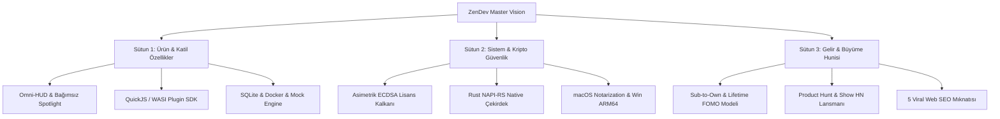

# 🌌 ZENDEV: GLOBAL DESKTOP POWERHOUSE & BÜYÜME MASTERPLANI (2026 - 2027)

> **Motto:** "The Ultimate Local-First Desktop Powerhouse for Developers & Cyber Engineers"  
> **Hazırlayan:** Antigravity Autonomous Strategy Board (AG-Kit Specialist Subagents)  
> **Hedef:** ZenDev'i Raycast, DevUtils ve Linear kalibresinde dünya standartlarında bir masaüstü güç merkezine ve aylık $10,000 – $50,000 ARR üreten sürdürülebilir bir yazılım imparatorluğuna dönüştürmek.

---

## 🏛️ ÜÇ TEMEL SÜTUN (MİMARİ VE STRATEJİK YAPI)

Bu ana plan; **Ürün Mimarisi**, **Sistem Güvenliği & Mühendislik** ve **Ticari Büyüme & Monetizasyon** olmak üzere üç bağımsız uzman subagent'ın analizleri sonucunda sentezlenmiş 4 aşamalı bir evrim protokolüdür:



---

## BÖLÜM 1: ÜRÜN MİMARİSİ VE KATİL ÖZELLİKLER (PRODUCT POWERHOUSE)

### 1.1 Bağımsız Spotlight Omni-HUD (Raycast / Alfred Katili)
- **Ayrı Mimari:** Ana pencereden bağımsız, sistem tepsisinde gizli bekleyen ikincil ultra-hafif BrowserWindow (`spotlightWindow`).
- **10-15ms Ekrana Fırlama Hızı:** GPU belleğinde hazır bekleyen sıfır gecikmeli arayüz.
- **Akıllı Pano Algılayıcı (Context-Aware Engine):**
  - Panoda **JSON** varsa -> Tek tıkla Formatla, Minify et, Zod/TypeScript şemasına dönüştür.
  - Panoda **JWT** varsa -> Anında decode et, exp süresi ve imza durumunu göster.
  - Panoda **cURL** varsa -> Anında çalıştır veya Sandbox'a aktar.
  - Panoda **Hex/RGB** varsa -> Renk önizleme ve Swift/Flutter/CSS formatlarına çevir.
- **Doğal Dil Hesap Makinesi & Birim Çevirici:** `(120 * 45) + 18%`, `150 USD to EUR`, `16GB to MB` anlık sonuç.

### 1.2 Mevcut 25+ Aracın Endüstriyel Seviyeye Evrimi
1. **Regex Studio Pro:**
   - Gerçek zamanlı **AST Railroad (Tren yolu) SVG Şeması**.
   - 6 dilde tek tıkla ReDoS korumalı kod üretimi (TypeScript, Python, Go, Rust, Java, C#).
   - ReDoS analizi ve CPU kilitlenme uyarıları.
2. **Local Mock Server & API Sandbox:**
   - Electron main process içinde çalışan dahili hafif HTTP/HTTPS mock sunucusu.
   - Gecikme enjeksiyonu (%10 500 error, 1200ms yapay gecikme), WebSocket ve SSE (Server-Sent Events) canlı test odası.
3. **JsonStudio -> SQLite & DuckDB Görselleştirici:**
   - `.sqlite`, `.db`, `.duckdb` dosyalarını sürükle-bırak ile anında açma, görsel şema inceleme ve SQL sorgu editörü.
   - JSON verisinden anında Zod, Prisma, Go Struct ve Rust Serde şablonu üretimi.
4. **Docker & Container Cockpit:**
   - Windows Named Pipe üzerinden Docker daemon'a bağlanma, aktif konteynerleri, bellek/CPU tüketimlerini ve portları izleme.
   - Tek tıkla "Dangling Images & Volumes" gigabaytlarca çöp temizleme.
5. **Knowledge Vault & Encrypted Scratchpad:**
   - Çift yönlü bağlantılı (`[[not]]`), Mermaid mimari diyagram render destekli, yerel AES-256-GCM ile şifrelenen not defteri.

### 1.3 Plugin & Extension SDK (Topluluk Ekosistemi)
- **Güvenlik Mimarisi:** QuickJS veya WASI (WebAssembly) sandbox ortamı ile ana bellekten izole eklenti çalıştırma.
- **İzin Modeli (`zendev-plugin.json`):** Pano okuma, ağ istekleri ve dosya erişimi kullanıcı onayına tabi.
- **Eklenti SDK'sı (`@zendev/sdk`):** Tip güvenli TypeScript API ile herkesin 10 dakikada yeni araç yazabilmesi.

### 1.4 Ses Profilleri & CLI Entegrasyonu
- **4 Seçilebilir Ses Teması:** Cyber Neon, Mechanical Switch (Holy Panda klavye sesleri), Linear Studio Hi-Fi ve Pure Stealth (Sessiz).
- **`zendev` Terminal CLI:** `zendev port kill 3000`, `zendev shred ./log.txt --passes 7`, `zendev mock --port 8080`.

---

## BÖLÜM 2: SİSTEM MİMARİSİ, GÜVENLİK & MÜHENDİSLİK (ENTERPRISE CORE)

### 2.1 Asimetrik Offline ECDSA (NIST P-256 / Ed25519) Lisans Güvenliği
- **Mevcut Durum:** Simetrik HMAC sırrı kod içinde açık hedef oluşturmaktadır.
- **Yeni Model:**
  - Sunucu tarafında (Railway Key Vault) yalnızca **Private Key** tutulur.
  - İstemciye (ZenDev Desktop) yalnızca **Public Key** gömülür.
  - Doğrulama tamamen çevrimdışı (offline) `crypto.verify` ile çalışır. Özel anahtar olmadan tek bir lisans dahi korsan üretilemez.
  - Lisans yükü CPU ID, BIOS UUID ve Disk Seri numarasının SHA-256 özeti olan `HWID` ile kilitlenir.

### 2.2 Çapraz Platform Yayılımı
1. **Windows ARM64 Desteği:** Qualcomm Snapdragon X Elite ve yeni nesil Surface cihazlar için native binary derleme (%40 pil ve CPU tasarrufu).
2. **macOS Notarization & Hardened Runtime:**
   - Apple Developer API Key ve `xcrun notarytool` ile CI üzerinden sıfır sürtünmeli noterleme.
   - M-serisi Apple Silicon (arm64) ve Intel (x64) için imzalı Universal DMG paketleri.
3. **Linux AppImage & Snap:** Ubuntu 24.04 unprivileged user namespace uyumluluğu ve kurumsal Snap paketi.

### 2.3 Performans & Rust NAPI-RS Native Çekirdek (`zendev-core-native`)
- **İş Parçacığı Ayrımı:** DoD 7-pass dosya imhası, büyük dosya şifreleme ve PDF işlemleri UI ve Main loop'u kilitlemeyen `worker_threads` havuzuna aktarılır.
- **Rust NAPI-RS Motoru:**
  - 45MB'lık `sharp/libvips` C++ bağımlılığı yerine ~4MB'lık hafif Rust `image` modülü.
  - Rust `lopdf` ile 10 kat daha hızlı, V8 heap'i şişirmeyen PDF birleştirme/bölme.
- **Bellek Ayak İzi Optimizasyonu:** Tepsiye (Tray) küçüldüğünde `EmptyWorkingSet` ve `global.gc()` çağrılarak RAM tüketimi 70-90MB seviyesine çekilir.

---

## BÖLÜM 3: TİCARİLEŞME, BÜYÜME VE GELİR MODELİ (REVENUE BLUEPRINT)

### 3.1 Fiyatlandırma Mimarisi (10.000$ - 50.000$ ARR Formülü)

$$\text{Gelir} = (\text{Pro Lisans Satışları} \times \text{LTV}) + (\text{Yıllık Güncelleme Yenilemeleri}) + (\text{B2B Team Koltukları})$$

| Paket | Fiyat | Model & Kapsam | Psikolojik Kanca |
|---|---|---|---|
| **Community (Free)** | $0 / Sonsuza dek | 10 Temel Araç, sınırsız kullanım | Sıfır sürtünmeli dağıtım motoru (Top of Funnel). |
| **ZenDev Pro** | **$39 / Yıl** | 2 Cihaz, 25+ aracın tamamı, Cyber Fortress, PDF Studio, Sentinel | **Sub-to-Own (JetBrains Modeli):** İptal edilse bile mevcut sürüm sonsuza dek çalışır! |
| **Yıllık Güncelleme** | **$19 / Yıl** | 1 yıl sonra yeni v3.x güncellemelerine devam etmek isteyenlere | %60+ yenileme (retention) ile sürekli ARR motoru. |
| **Lifetime Founder** | **$69 Tek Seferlik** | Sınırlı 1.000 Lisans, 3 Cihaz, Ömür boyu tüm güncellemeler | **Lansman FOMO'su:** İlk haftada $30,000+ nakit girişi. |
| **Team / Studio** | **$99 / Koltuk / Yıl** | Merkezi Lisans Konsolu, Kurumsal Fatura, VIP Destek | B2B ajanslar ve yazılım şirketleri için koltuk başı lisans. |

### 3.2 GTM & Dağıtım Stratejisi
1. **Product Hunt Lansmanı:** Salı 00:01 PST zamanlaması, 45 saniyelik cyberpunk demo videosu ve `%20 Lansman İndirimi` ile Product of the Day (Top 1-3) hedefi.
2. **Hacker News 'Show HN':** Sıfır telemetri, Wireshark ile izlenebilir gizlilik, DoD silme ve Rust/Electron bellek optimizasyonları odaklı teknik şeffaflık yazısı.
3. **Reddit Gerilla Pazarlaması:** r/webdev, r/sysadmin ve r/privacy topluluklarında "Verilerinizi rastgele web formatlayıcılarına yüklemeyi bırakın" başlığıyla problem-çözüm paylaşımları.
4. **5 Viral Web SEO Mıknatısı (Free Engineering as Marketing):**
   - `zendev.app/tools/json-formatter-validator` (450k arama)
   - `zendev.app/tools/regex-cheat-sheet-tester` (320k arama)
   - `zendev.app/tools/port-pid-finder-windows` (90k arama)
   - `zendev.app/tools/chmod-file-permission-calculator` (80k arama)
   - `zendev.app/tools/password-entropy-generator` (110k arama)
   *Web sayfasını ziyaret edenlere "Bu aracı %100 internetsiz çalıştırmak için ZenDev Desktop'ı indirin" banner'ı.*
5. **LemonSqueezy 3 Aşamalı Terk Edilmiş Sepet Akışı:** 1. saatte hatırlatma, 24. saatte %15 indirim kuponu, 72. saatte iade garantisiyle terk edilen sepetlerin %20'sini satışa çevirme.

---

## BÖLÜM 4: 4 AŞAMALI UYGULAMA YOL HARİTASI (PHASED EXECUTION ROADMAP)

```
2026 Q3                   2026 Q4                   2027 Q1                   2027 Q2
┌───────────────────────┐ ┌───────────────────────┐ ┌───────────────────────┐ ┌───────────────────────┐
│ FAZ 1: TİCARİ LANSMAN │ │ FAZ 2: OMNI-HUD &     │ │ FAZ 3: EKLENTİ SDK    │ │ FAZ 4: KURUMSAL B2B   │
│ & GÜVENLİK TEMELİ     │ │ ENDÜSTRİYEL ARAÇLAR   │ │ & RUST NATIVE CORE    │ │ & EKOSİSTEM İMPARATOR.│
├───────────────────────┤ ├───────────────────────┤ ├───────────────────────┤ ├───────────────────────┤
│• Asimetrik ECDSA kalkan│• Bağımsız Spotlight HUD│• QuickJS/WASI SDK     │• ZenDev Team Hub        │
│• Code signing hazırlık│• SQLite / DuckDB GUI   │• Rust napi-rs çekirdek │• zendev CLI terminal    │
│• Product Hunt lansmanı│• Regex Lab Pro & AST   │• macOS Notarization    │• Air-Gapped kurumsal    │
│• Lifetime Founder satışı│• API Mock & SSE Server │• 5 Viral Web SEO aracı │• 50.000$ ARR Koşu Hızı  │
└───────────────────────┘ └───────────────────────┘ └───────────────────────┘ └───────────────────────┘
```

### Aşama Detayları:
- **Faz 1 (Hemen / 1-4. Hafta):** Asimetrik ECDSA lisans motorunun devreye alınması, LemonSqueezy'de Sub-to-own varyantlarının açılması, Product Hunt ve Hacker News lansman kampanyası.
- **Faz 2 (Ay 2-3):** Bağımsız BrowserWindow Spotlight Omni-HUD (15ms açılış, akıllı pano tespiti), SQLite görselleştirici ve Regex AST motoru.
- **Faz 3 (Ay 4-5):** `@zendev/sdk` eklenti motoru, Rust NAPI-RS çekirdeği ile C++ bağımlılıklarının temizlenmesi, macOS Apple Silicon noterleme ve 5 viral web aracının SEO'ya açılması.
- **Faz 4 (Ay 6-8):** Kurumsal Team Hub (koltuk yönetimi), `zendev` CLI arayüzü ve yıllık güncelleme yenilemeleriyle $50,000 ARR bandına yerleşme.

---

## SONUÇ VE EYLEM KARARI

ZenDev, temel taşları halihazırda sağlam atılmış, 25+ aracı çalışan nadir nitelikte bir projedir. Bu devasa plan, projeyi amatör bir araç derlemesinden çıkarıp **küresel geliştirici kitlesinin vazgeçilmez masaüstü işletim sistemi katmanına** dönüştürmek için tasarlanmıştır.

Tüm kod altyapısı, veritabanı şemaları ve dağıtım scriptleri bu plana tam uyumlu olarak adım adım uygulanmaya hazırdır.
