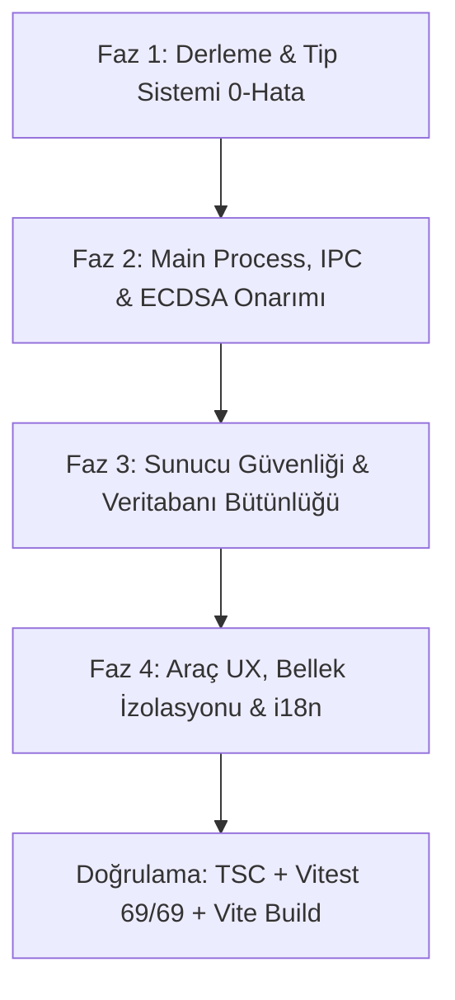

# 🛡️ ZenDev / NexusHub — Devasa Kapsamlı BugFix Master Planı

**Tarih:** 10 Eylül 2026  
**Hedef Proje:** `c:\Users\futbo\Desktop\AI Projeleri\NexusHub`  
**Kapsam:** 25 Masaüstü Aracı, Electron Main Process, Preload, IPC, Arka Plan Servisleri, Sunucu Altyapısı (`server/`) ve i18n Sözlükleri.

---

## 📌 1. Yönetici Özeti & Denetim Bulguları

Paralel çalışan alt ajan denetimleri sonucunda sistem genelinde tespit edilen açıklar 4 ana fazda sınıflandırılmıştır:

1. **Derleme & Tip Sistemi Hataları:**
   - `src/renderer/src/lib/ipc.ts` ve `src/renderer/src/env.d.ts` arasındaki `flushDns`, `system`, `settings` ve `category` union uyuşmazlıkları (`tsconfig.web.json`).
   - `src/main/ipc/networkTools.ts:211` TLS sertifika subject/issuer nesnelerinde `string | string[] | undefined` uyumsuzluğu (`tsconfig.node.json`).
   - `Scratchpad.tsx:75` Web Crypto `salt` tipi BufferSource çakışması.
   - `src/main/tray.ts:11` `NativeImage` tip tanımı.
   - `tsconfig.node.json` içine `src/shared/**/*` modüllerinin dahil edilmemesi.

2. **Çalışma Zamanı (Runtime) ve Mantık Hataları:**
   - `src/main/ipc/license.ts:115` satırında `rawKey.length > 64` tavanı nedeniyle geçerli ECDSA lisanslarının (~300-500 karakter) doğrudan reddedilmesi.
   - `licenseStore.ts:59` HWID parametresini `validateLicenseKey`'e iletmediği için donanıma kilitli ECDSA anahtarlarının geçersiz sayılması.
   - `Scratchpad.tsx:93` satırındaki `String.fromCharCode(...combined)` spread işleminin 64KB üzeri notlarda `RangeError: Maximum call stack size exceeded` üretmesi.
   - `Scratchpad.tsx:357` satırında dependency array'de `activeNote` bulunduğu için her harf yazılışında 3 dakikalık snapshot zamanlayıcısının sıfırlanması (otomatik kaydın asla çalışmaması).
   - `FakeDataStudio.tsx:32` satırında negatif modülo `%` kaynaklı negatif TC Kimlik Numarası basamağı üretilmesi.
   - `SqliteViewer.tsx` bileşeninde `dbInstance.close()` çağrılmadığı için WebAssembly Linear Memory sızıntısı.
   - `CyberFortress.tsx:522` steganografi okumasında sınır kontrolü yapılmadığı için küçük görsellerde out-of-bounds bellek okuması.
   - `ClipboardManager.tsx:156` silinen sabitlenmiş (pinned) panoların `localStorage`'dan temizlenmemesi.

3. **Sunucu Güvenliği ve Veri Bütünlüğü (`server/`):**
   - `server/src/routes/admin.ts:520` satırında lisans notu güncellenirken SQL sorgusunda yanlışlıkla `order_id` alanının ezilmesi (Kritik Veri Kaybı).
   - `server/src/routes/admin.ts:55` brute-force engelleme Map'inde TTL / GC temizliğinin olmaması (bellek şişmesi).
   - `server/src/routes/webhook.ts:57` ham gövde JSON.parse işleminin try/catch dışında kalması.
   - `server/src/index.ts:29` stream middleware'inde `req.on('error')` dinlenmediği için kopan istemcilerde Express'in askıda kalması.
   - `server/src/index.ts:245` kamuya açık aktivasyon akışında lisans anahtarı öneklerinin sızması.

4. **Kullanıcı Deneyimi ve i18n:**
   - Toplam **11 araçta** (`sentinel`, `devSandbox`, `cyberFortress`, `regexStudio`, `fakeData`, `curlRunner`, `systemOptimizer`, `colorStudio`, `portKiller`, `scratchpad`, `pdfStudio`) eksik olan i18n anahtarları.
   - `CurlRunner` ve `DevSandbox` isteklerinin Chromium renderer'dan atılması sebebiyle CORS/CSP engeline takılması.

---

## 🗺️ 2. Aşamalı Eylem Planı (Execution Roadmap)



---

### FAZ 1: Kritik Derleme ve Tip Sistemi Onarımı (Öncelik: P0)

1. **`src/renderer/src/env.d.ts` & `src/renderer/src/lib/ipc.ts` Eşitlemesi:**
   - `env.d.ts` dosyasında `pdf` arayüzüne `inspectFiles` metodunu ekle.
   - `system` ve `settings` arayüzlerini zorunlu alan yap (`system: { ... }`).
   - `decrypter.clean` dönüşündeki `category` alanını `RemovedTrackerInfo['category']` union tipiyle eşitle.
2. **`src/main/ipc/networkTools.ts:211-218`:**
   - TLS subject ve issuer string dizilerini stringe dönüştürerek `SslCertResult` tip uyumunu sağla:
     ```typescript
     CN: Array.isArray(cert.subject?.CN) ? cert.subject.CN.join(', ') : cert.subject?.CN
     ```
3. **`Scratchpad.tsx:75` Web Crypto BufferSource:**
   - `salt` parametresini `salt.buffer as ArrayBuffer` olarak cast et.
4. **`src/main/tray.ts:11`:**
   - Fonksiyon dönüş tipini `Electron.NativeImage` olarak tanımla.
5. **`tsconfig.node.json`:**
   - `"include"` dizisine `"src/shared/**/*"` ekle.

---

### FAZ 2: Main Process, IPC & ECDSA Lisans Motoru (Öncelik: P0 - P1)

1. **`src/main/ipc/license.ts:115` 64 Karakter Tavanının Kaldırılması:**
   - `rawKey.length > 64` sınırını 1024 karaktere çıkararak asimetrik ECDSA anahtarlarının kabul edilmesini sağla.
2. **`licenseStore.ts:59` HWID Doğrulaması:**
   - `validateKey` fonksiyonuna `getDeviceId()` parametresini bağla.
3. **IPC Kanallarına Giriş Guard Korumaları:**
   - `cyberFortressIPC.ts`: `filePath` ve `passphrase` için boş/undefined kontrolü ekle.
   - `pdfToolkit.ts`: `filePaths` dizi kontrolü ekle.
   - `fileOrganizer.ts`: `operations` parametresi için `Array.isArray` doğrulaması ekle.
4. **Sentinel Sahte GC'nin Temizlenmesi:**
   - `powershell.exe [System.GC]::Collect()` kaldırılacak; `if (global.gc) global.gc()` kullanılacak.
5. **Pencere Görünürlük Sinyali (Background CPU Koruyucu):**
   - Pencere minimize olduğunda `app:visibility-change(false)` sinyali gönderilecek; `ResourceSentinel` ve `TempMail` aralıklarını rölantiye alacak.

---

### FAZ 3: Sunucu Güvenliği, Veri Bütünlüğü & Veritabanı Onarımı (Öncelik: P1)

1. **`server/src/routes/admin.ts:520` Kritik Veri Kaybı Düzeltmesi:**
   ```sql
   -- DÜZELTME:
   UPDATE licenses SET customer_note = ? WHERE key = ?
   ```
2. **`server/src/routes/admin.ts` Bellek Sızıntısı:**
   - 10 dakikada bir süresi dolan `loginAttempts` kayıtlarını temizleyen GC zamanlayıcısı ekle.
3. **`server/src/routes/webhook.ts:57`:**
   - `JSON.parse(rawBody)` işlemini try/catch içine al; bozuk isteklerde 400 Bad Request döndür.
4. **`server/src/index.ts:29` Stream Hata Yakalama:**
   - `req.on('error', (err) => next(err))` ekle.
5. **Anti-Spoofing & Key Maskeleme:**
   - `app.set('trust proxy', 1)` ekle; public aktivasyon akışında anahtarları maskele.

---

### FAZ 4: Araç UI/UX, Mantık Düzeltmeleri & Eksiksiz i18n Sözlükleri (Öncelik: P2)

1. **`Scratchpad.tsx` Call Stack & Snapshot Düzeltmesi:**
   - Base64 dönüştürücüyü `btoa(new TextDecoder('latin1').decode(combined))` yapısına geçir.
   - 3 dakikalık snapshot zamanlayıcısını `useRef` ile bağla, harf girişlerinde süreyi sıfırlama.
2. **`FakeDataStudio.tsx` TC Kimlik Matematik Onarımı:**
   - Negatif modülo koruması ekle: `((oddSum * 7 - evenSum) % 10 + 10) % 10`.
3. **`SqliteViewer.tsx` WebAssembly Bellek Temizliği:**
   - Yeni dosya açılışında ve bileşen unmount'unda `dbInstance.close()` çalıştır.
4. **`CyberFortress.tsx` Steganografi Kapasite Kontrolü:**
   - Görsel piksel sınırını aşan durumlarda güvenli hata fırlat.
5. **`ClipboardManager.tsx`:**
   - Sabitlenen panolar silindiğinde `localStorage` senkronizasyonunu sağla.
6. **Eksik 11 Aracın i18n Sözlüklerine Eklenmesi:**
   - `tr.json` ve `en.json` dosyalarına eksik 11 aracın başlık, etiket ve buton metinlerini ekle; `Dashboard.tsx` hardcoded metinlerini temizle.

---

## 🧪 3. Doğrulama ve Kabul Kriterleri (Verification Checklist)

| Test Adımı | Hedef | Beklenen Çıktı |
| :--- | :--- | :--- |
| **Renderer TSC** | `npx tsc -p tsconfig.web.json --noEmit` | 0 Hata |
| **Main Process TSC** | `npx tsc -p tsconfig.node.json --noEmit` | 0 Hata |
| **Server TSC** | `cd server && npx tsc --noEmit && cd ..` | 0 Hata |
| **Vitest** | `npm test -- --run` | 69/69 PASS (%100) |
| **Electron Vite Build**| `npx electron-vite build` | Sorunsuz bundle üretimi |
